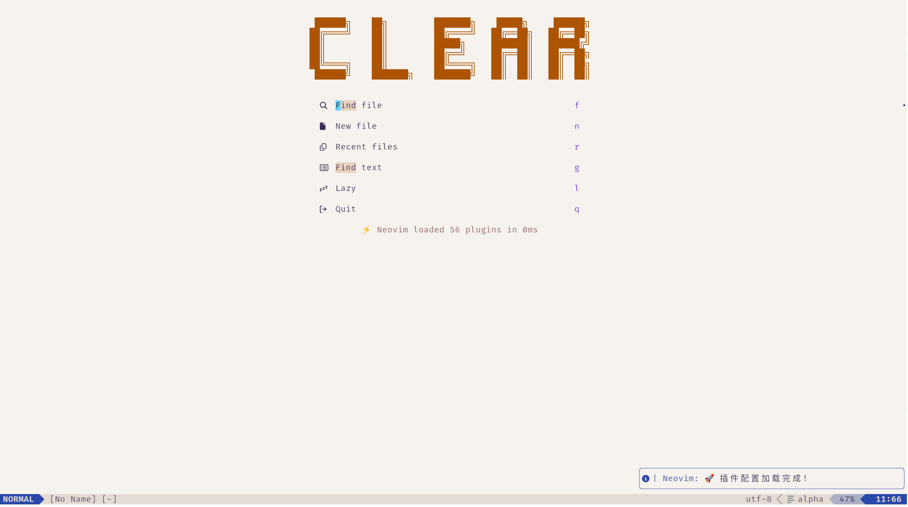
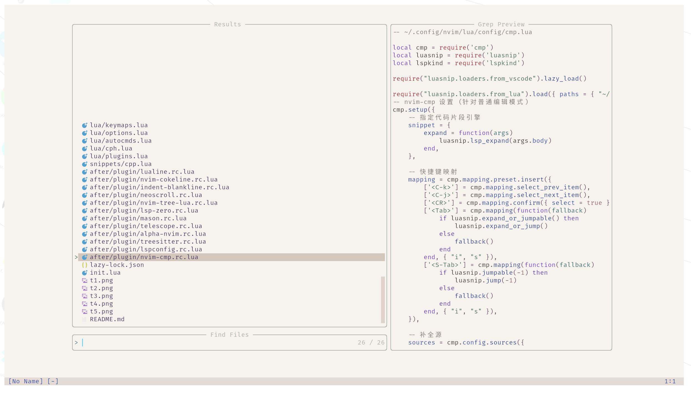
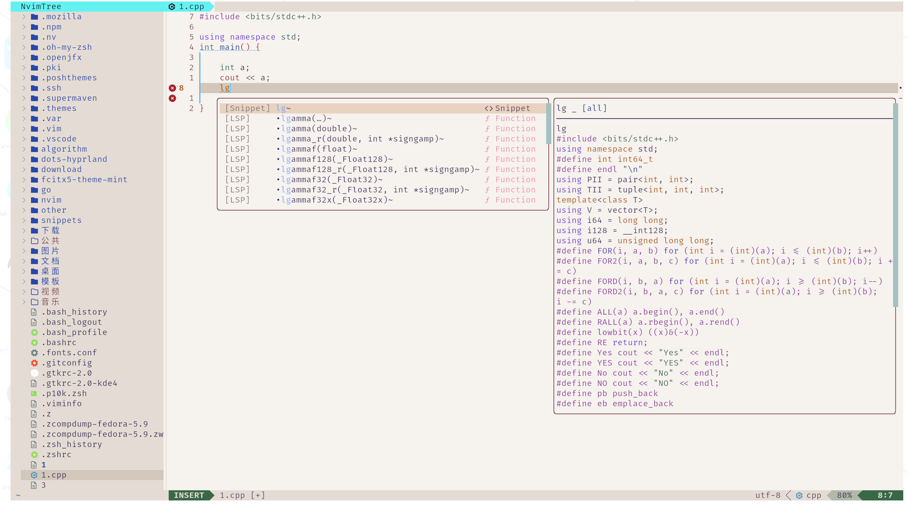
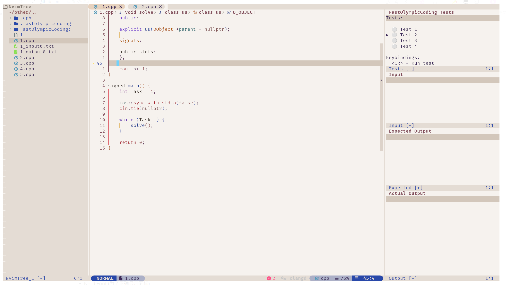
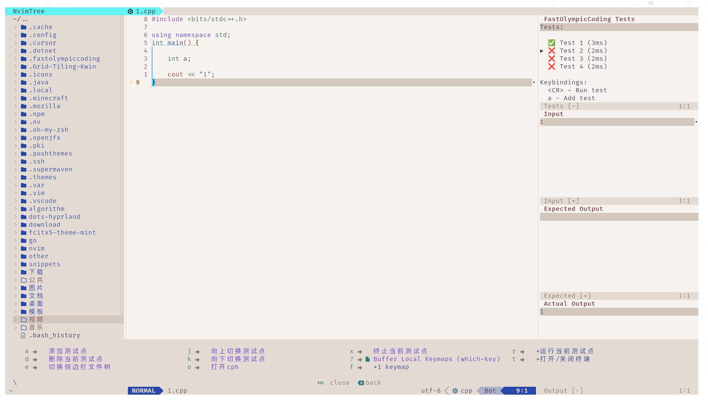

## clear-Neovim 配置
这是一个为现代文本编辑量身定制的、功能丰富的 Neovim 配置。它旨在提供一个美观、高效且对开发者友好的环境。

## 概览
本配置整合了一系列精心挑选的插件，以增强 Neovim 的核心功能，涵盖了从代码补全、导航到美学定制的方方面面。无论您是经验丰富的开发者还是 Neovim 的新用户，都能轻松上手并根据自己的喜好进行调整。

## 概念图
以下截图展示了本配置在不同场景下的视觉效果和主要功能界面。










## 安装
1. 依赖:
- Neovim v0.8.0+
- Nerd Font (为了正确显示图标)
- clang-format
2. 备份您的旧配置:
```
mv ~/.config/nvim ~/.config/nvim.bak
mv ~/.local/share/nvim ~/.local/share/nvim.bak
```
3. 克隆本仓库:
```
git clone <您的仓库地址> ~/.config/nvim
Use code with caution.
```
4. 启动 Neovim:
打开 Neovim，插件管理器将自动开始安装所有插件。

## 插件列表
本配置使用的插件按功能分类如下：
<details>
<summary><strong>核心 / 插件管理</strong></summary>
插件	描述
folke/lazy.nvim	核心插件管理器
nvim-lua/plenary.nvim	许多插件依赖的 Lua 工具库
</details>
<details>
<summary><strong>UI / 外观</strong></summary>
插件	描述
EdenEast/nightfox.nvim	颜色主题 (dayfox)
xiyaowong/nvim-transparent	背景透明
nvim-lualine/lualine.nvim	功能强大的状态栏
nvim-tree/nvim-web-devicons	文件和UI图标
lukas-reineke/indent-blankline.nvim	缩进线显示
goolord/alpha-nvim	自定义启动屏幕
folke/noice.nvim	替代 Neovim 的默认 UI，美化消息、命令和弹出菜单
rcarriga/nvim-notify	漂亮的通知系统
j-hui/fidget.nvim	LSP 加载状态提示
folke/zen-mode.nvim	专注模式
</details>
<details>
<summary><strong>LSP / 代码补全 / 语法</strong></summary>
插件	描述
VonHeikemen/lsp-zero.nvim	预设好的 LSP 配置方案，简化配置
neovim/nvim-lspconfig	Neovim LSP 配置集合
williamboman/mason.nvim	自动安装和管理 LSP 服务器
williamboman/mason-lspconfig.nvim	连接 Mason 和 lspconfig
hrsh7th/nvim-cmp	代码补全引擎
L3MON4D3/LuaSnip	代码片段引擎
rafamadriz/friendly-snippets	预设的通用代码片段库
onsails/lspkind-nvim	在补全菜单中显示 VSCode 风格的图标
pmizio/typescript-tools.nvim	专为 TypeScript 优化的 LSP 工具
nvim-treesitter/nvim-treesitter	更快更准的语法高亮和代码解析
mhartington/formatter.nvim	代码格式化框架
rachartier/tiny-inline-diagnostic.nvim	在行内显示诊断信息
kosayoda/nvim-lightbulb	当有代码动作可用时显示灯泡图标
</details>
<details>
<summary><strong>编辑增强 / 工具</strong></summary>
插件	描述
nvim-tree/nvim-tree.lua	文件浏览器
nvim-telescope/telescope.nvim	模糊搜索器 (文件, Grep, Buffer...)
willothy/nvim-cokeline	智能且美观的 Buffer/Tab 行
lewis6991/gitsigns.nvim	在符号列（Sign Column）显示 Git 状态
akinsho/toggleterm.nvim	可切换的浮动/分屏终端
windwp/nvim-autopairs	自动补全括号、引号等
windwp/nvim-ts-autotag	自动重命名和关闭 HTML 标签
RRethy/vim-illuminate	高亮当前光标下单词的其他实例
norcalli/nvim-colorizer.lua	实时显示CSS颜色代码的颜色
folke/todo-comments.nvim	高亮并搜索项目中的 TODO, FIXME 等注释
TobinPalmer/rayso.nvim	通过 ray.so 生成精美的代码截图
michaelrommel/nvim-silicon	本地生成代码截图
folke/which-key.nvim	快捷键提示窗口
karb94/neoscroll.nvim	平滑滚动效果
</details>
