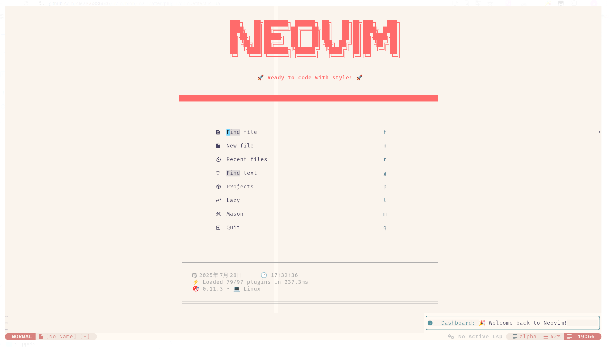
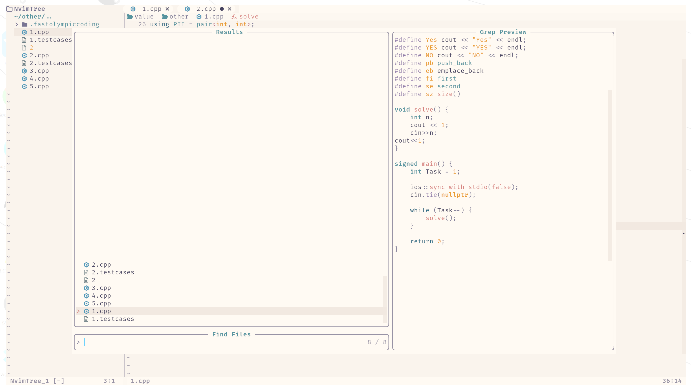
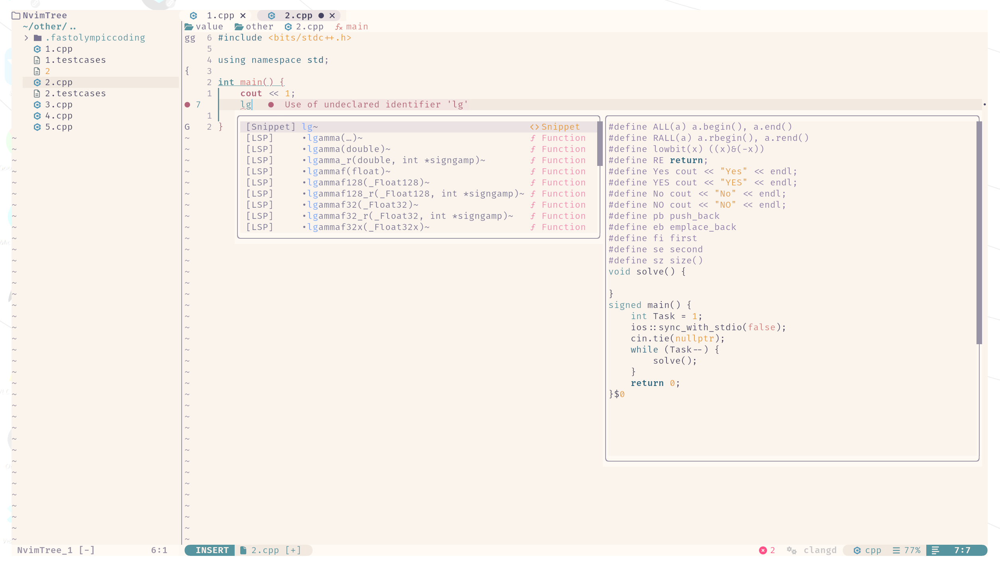
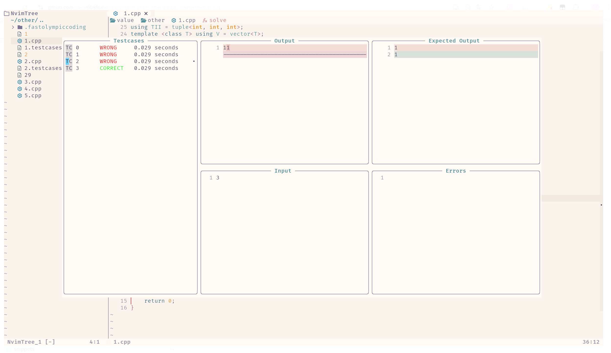
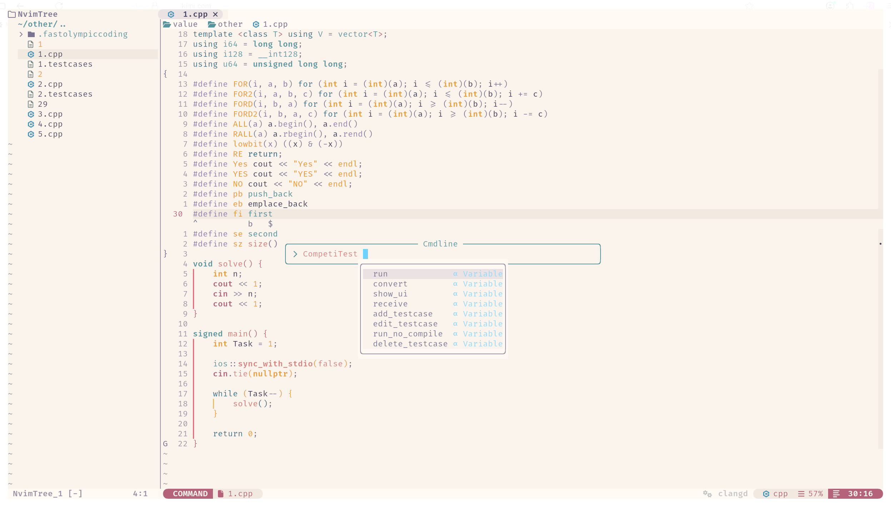
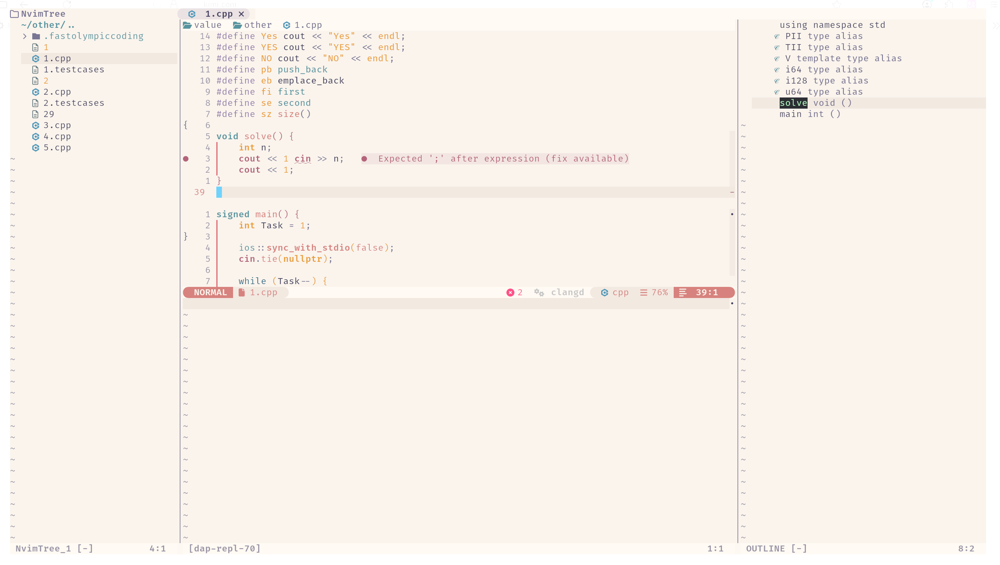

# Clear-Nvim 配置

> 基于 `lazy.nvim` 的 **“开箱即用”** 全栈 IDE，针对 **C++ / Rust / Python** 深度优化，可适用于项目学习和算法学习，颜值 & 效率 **双在线**！

## 📸 总览













## ⚠️ 安装前必读 – 系统依赖

- 字体：Nerd Font。

- 软件：

| 软件         | 最低版本  | 作用             | 一键检测脚本             |
| ---------- | ----- | -------------- | ------------------ |
| **Neovim** | 0.9+  | 主程序            | `nvim --version`   |
| **Git**    | 2.30+ | 拉取插件 / 更新      | `git --version`    |
| **Clang**  | 15+   | C++ LSP / 调试   | `clangd --version` |
| **fd**     | 8.0+  | Telescope 文件搜索 | `fd --version`     |
| **npm**     | 8.0+  | 安装部分LSP及插件依赖 (如 markdown-preview) | `npm --version`     |

- 编译（可选）：安装开发工具包（Development Tools"）

> 如果缺少任何一项，请先按下方「快速安装依赖」操作，再继续！

---

## 🚀 快速安装依赖

### macOS

```bash
brew install neovim git llvm fd npm
```

### Ubuntu / Debian

```bash
sudo apt update
sudo apt install neovim git clangd fd-find npm
# Ubuntu 仓库的 clangd 可能版本较低，可以用：
# sudo snap install clangd --classic
```

### Arch / Manjaro

```bash
sudo pacman -S neovim git clang fd npm
```

### Fedora/Red Hart

```bash
sudo dnf install neovim git clang fd npm
```

### Windows (Scoop)

```powershell
scoop install neovim git llvm fd npm
```

## 🚦 一键安装

```bash
mv ~/.config/nvim{,.bak}
git clone https://github.com/clear668866x6/nvim.git ~/.config/nvim
nvim
```

## 🎨 功能总览

`<leader>` 是 `\` 键。

| 场景                     | 插件/模块                                                  | 关键命令 & 效果                                               |
| ---------------------- | ------------------------------------------------------ | ------------------------------------------------------- |
| **主题 / UI**            | rose-pine, lualine, dropbar, smear-cursor, transparent | 启动即渲染；状态栏显示 LSP/编译/测试实时状态                               |
| **文件树**                | nvim-tree.lua                                          | `<leader>e` 开/关；`<leader>tf` 定位当前文件                     |
| **Buffer 栏**           | cokeline.nvim                                          | `<Tab>` / `<S-Tab>` 左右切换；                               |
| **符号大纲**               | symbols-outline.nvim                                   | `<leader>so` 开关；点击或回车跳转                                 |
| **Git**                | gitsigns + diffview + fugitive                         | `<leader>gd` 查看 diff；`<leader>gh` file-history          |
| **Debug (C/C++/Rust)** | nvim-dap + clangd_extensions / rustaceanvim            | `<F5>` 启动；`<F10>` 单步；鼠标悬停变量                             |
| **Debug (Python)**     | nvim-dap-python                                        | `<leader>dpr` 调试光标函数；自动连接 venv                          |
| **单元测试**               | neotest + neotest-{python,rust,gtest}                  | `<leader>tt` 最近测试；`<leader>tf` 整个文件；`<leader>ts` 摘要     |
| **代码覆盖率**              | nvim-coverage                                          | `<leader>cc` 加载；`<leader>ct` 开关行内高亮                     |
| **CMake 工作流**          | cmake-tools.nvim                                       | `:CMakeGenerate` / `:CMakeBuild` / `:CMakeDebug`        |
| **Rust 辅助**            | rustaceanvim + crates.nvim                             | `<leader>dr` debug；Cargo.toml hover 版本提示                |
| **Python 辅助**          | venv-selector + ruff                                   | `:VenvSelect` 选环境；保存即格式化                                |
| **竞赛辅助**               | competitest.nvim                                       | `<leader>a` 增加测试点；`<leader>d` 删除测试点；`<leader>ra` 运行测试点。 |

> 代码片段在根目录的/snippets下，可以修改为自己的代码片段。

## 📂 仓库结构

```
.
├── init.lua
├── after/
|     └── plugin/
├── lua/
│  ├── plugins/      -- 所有 lazy.nvim 插件声明
├── snippets/          -- 代码片段（可以在这里修改代码片段）
├── photo/
└── README.md        -- 本文
```

## 📋 完整快捷键速查

| 模式     | 按键                                         | 功能             |
| ------ | ------------------------------------------ | -------------- |
| 全局     | `<leader>ff`                               | Telescope 找文件  |
| 全局     | `<leader>e`                                | 文件树            |
| Buffer | `<Tab>` / `<S-Tab>`                        | 左右切换标签         |
| Debug  | `<F5>` / `<F10>` / `<F11>`                 | 启动 / 单步 / 进入   |
| 测试     | `<leader>tt` / `<leader>tf` / `<leader>ts` | 最近 / 文件 / 摘要   |
| 竞赛     | `<leader>cp` / `<leader>co` / `<leader>r`  | 单题 / 整场 / 运行样例 |
| 覆盖率    | `<leader>cc` / `<leader>ct`                | 加载 / 开关        |
| 代码格式   | `esc`                                      | 保存+格式化         |
| Rust   | `<leader>dr`                               | 调试可执行          |
| Python | `:VenvSelect` / `<leader>dpr`              | 选 venv / 调试函数  |

> 其余快捷键 `:WhichKey <leader>` 查看！

## 📋 插件

| 类别            | 插件名                                     | 作用简介                          | 可选  |
| ------------- | --------------------------------------- | ----------------------------- | --- |
| 主题配色          | rose-pine/neovim                        | Rosé Pine 主题（dawn 变体）         | ✓   |
| 状态栏/Tab       | nvim-lualine/lualine.nvim               | 底部状态栏                         | ✓   |
| 文件树           | nvim-tree/nvim-tree.lua                 | 侧边文件树                         | ✓   |
| Buffer 标签     | willothy/nvim-cokeline                  | 顶部 Buffer 标签栏                 | ✓   |
| 语法高亮          | nvim-treesitter/nvim-treesitter         | Tree-sitter 语法高亮              | —   |
| 缩进线           | lukas-reineke/indent-blankline.nvim     | 显示缩进参考线                       | ✓   |
| 平滑滚动          | karb94/neoscroll.nvim                   | 平滑滚动动画                        | ✓   |
| Git 标记        | lewis6991/gitsigns.nvim                 | 行内增删改提示                       | —   |
| Git Blame     | f-person/git-blame.nvim                 | 行内 blame 信息                   | ✓   |
| Git 差异/历史     | sindrets/diffview.nvim                  | Diff 视图与文件历史                  | ✓   |
| Git 命令        | tpope/vim-fugitive                      | 经典 Git 命令封装                   | ✓   |
| 颜色高亮          | brenoprata10/nvim-highlight-colors      | Hex/Tailwind 颜色预览             | ✓   |
| 上下文函数名        | nvim-treesitter/nvim-treesitter-context | 顶部当前函数/类提示                    | ✓   |
| 词语高亮          | RRethy/vim-illuminate                   | 高亮当前光标下相同词语                   | ✓   |
| 彩虹括号          | HiPhish/rainbow-delimiters.nvim         | 成对括号多彩显示                      | ✓   |
| LSP 零配置       | VonHeikemen/lsp-zero.nvim               | LSP+补全一站式预设                   | —   |
| LSP 配置        | neovim/nvim-lspconfig                   | LSP 客户端基础配置                   | —   |
| LSP 安装        | williamboman/mason.nvim                 | 一键安装 LSP/DAP/Formatter        | —   |
| LSP 桥接        | williamboman/mason-lspconfig.nvim       | mason⇄lspconfig 联动            | —   |
| C++ 增强        | p00f/clangd_extensions.nvim             | clangd 增强 & inlay hints       | ✓   |
| Rust 增强       | mrcjkb/rustaceanvim                     | rust-analyzer 增强              | ✓   |
| Python 虚拟环境   | linux-cultist/venv-selector.nvim        | 选择/切换 Python venv             | ✓   |
| Python 调试     | mfussenegger/nvim-dap-python            | Python DAP 适配器                | ✓   |
| 通用调试          | mfussenegger/nvim-dap                   | Debug Adapter Protocol 核心     | —   |
| 调试 UI         | rcarriga/nvim-dap-ui                    | 调试浮动窗口                        | —   |
| 虚拟文本提示        | theHamsta/nvim-dap-virtual-text         | 调试变量虚拟文本                      | ✓   |
| 补全引擎          | hrsh7th/nvim-cmp                        | 自动补全核心                        | —   |
| 补全源           | hrsh7th/cmp-* 等                         | buffer/path/LSP/LuaSnip 等来源   | —   |
| 片段引擎          | L3MON4D3/LuaSnip                        | 代码片段展开                        | —   |
| 片段库           | rafamadriz/friendly-snippets            | 常用语言预设片段                      | ✓   |
| 补全图标          | onsails/lspkind-nvim                    | VSCode 风格补全图标                 | ✓   |
| HTML/TS 标签    | windwp/nvim-ts-autotag                  | 自动闭合/重命名标签                    | ✓   |
| TypeScript 增强 | pmizio/typescript-tools.nvim            | 更快的 TypeScript LSP            | ✓   |
| Tailwind 补全   | roobert/tailwindcss-colorizer-cmp.nvim  | Tailwind 颜色补全                 | ✓   |
| 诊断列表          | folke/trouble.nvim                      | 统一显示 LSP 诊断                   | ✓   |
| TODO 高亮       | folke/todo-comments.nvim                | 高亮 TODO/FIXME 等注释             | ✓   |
| Telescope     | nvim-telescope/telescope.nvim           | 模糊查找文件/grep/符号                | —   |
| 终端            | akinsho/toggleterm.nvim                 | 浮动/横向终端                       | ✓   |
| 通知美化          | rcarriga/nvim-notify                    | 弹出通知样式                        | ✓   |
| 光标动画          | sphamba/smear-cursor.nvim               | 平滑光标移动残影                      | ✓   |
| 图标库           | nvim-tree/nvim-web-devicons             | 文件类型图标                        | —   |
| 代码运行          | CRAG666/code_runner.nvim                | 一键运行代码                        | ✓   |
| Discord 状态    | vyfor/cord.nvim                         | Discord Rich Presence         | ✓   |
| 格式化           | mhartington/formatter.nvim              | 异步代码格式化                       | ✓   |
| 括号补全          | windwp/nvim-autopairs                   | 成对符号自动补全                      | —   |
| 导航面包屑         | SmiteshP/nvim-navic                     | LSP 路径面包屑                     | ✓   |
| 启动页           | goolord/alpha-nvim                      | 启动欢迎页                         | ✓   |
| 专注模式          | folke/zen-mode.nvim                     | 无干扰写作模式                       | ✓   |
| 滚动条           | petertriho/nvim-scrollbar               | 编辑器滚动条                        | ✓   |
| 缩略图           | gorbit99/codewindow.nvim                | 右侧代码缩略图                       | ✓   |
| 截图            | michaelrommel/nvim-silicon              | 代码高亮截图                        | ✓   |
| 在线截图          | TobinPalmer/rayso.nvim                  | 生成 ray.so 分享图                 | ✓   |
| 键位提示          | folke/which-key.nvim                    | 快捷键提示弹窗                       | ✓   |
| 智能提示灯         | kosayoda/nvim-lightbulb                 | 代码操作提示灯泡                      | ✓   |
| 面包屑导航         | Bekaboo/dropbar.nvim                    | 顶部路径/符号面包屑                    | ✓   |
| Nerd 图标       | 2kabhishek/nerdy.nvim                   | 浏览/插入 Nerd Font 图标            | ✓   |
| 括号彩虹          | sontungexpt/bim.nvim                    | 插入模式彩虹括号                      | ✓   |
| 注释            | numToStr/Comment.nvim                   | gcc/gbc 快速注释                  | —   |
| 可视化空白         | mcauley-penney/visual-whitespace.nvim   | Visual 模式空白字符                 | ✓   |
| 智能缩进          | vidocqh/auto-indent.nvim                | 实时自动缩进                        | ✓   |
| 增强提示          | soulis-1256/eagle.nvim                  | 浮动提示/诊断美化                     | ✓   |
| 定义预览          | dnlhc/glance.nvim                       | 侧边预览定义/引用                     | ✓   |
| 迷你诊断          | rachartier/tiny-inline-diagnostic.nvim  | 行内简洁诊断                        | ✓   |
| 模式指示          | mawkler/modicator.nvim                  | 根据模式变色光标                      | ✓   |
| 重命名           | smjonas/inc-rename.nvim                 | 增量重命名                         | ✓   |
| UI 增强         | stevearc/dressing.nvim                  | 统一 vim.ui 选择/输入框              | ✓   |
| 列宽提示          | m4xshen/smartcolumn.nvim                | 超长行高亮                         | ✓   |
| 测试框架          | nvim-neotest/neotest                    | 统一 Python/Rust/C++ 测试         | ✓   |
| 测试适配器         | neotest-*                               | Python(pytest)/Rust/gtest 适配器 | ✓   |
| 代码覆盖率         | andythigpen/nvim-coverage               | 加载并高亮测试覆盖率                    | ✓   |
| 项目管理          | ahmedkhalf/project.nvim                 | 自动识别根目录/最近项目                  | ✓   |
| 符号大纲          | simrat39/symbols-outline.nvim           | 侧边符号树                         | ✓   |
| 函数签名          | ray-x/lsp_signature.nvim                | 浮动函数签名提示                      | ✓   |
| LSP 美化        | glepnir/lspsaga.nvim                    | 增强 LSP UI（finder/重命名/代码操作等）   | ✓   |
| Markdown 预览   | iamcco/markdown-preview.nvim            | 实时 Markdown 预览                | ✓   |
| 搜索替换          | nvim-pack/nvim-spectre                  | 全局搜索替换面板                      | ✓   |
| 快速修复增强        | kevinhwang91/nvim-bqf                   | Quickfix 窗口预览/过滤              |     |

# 
